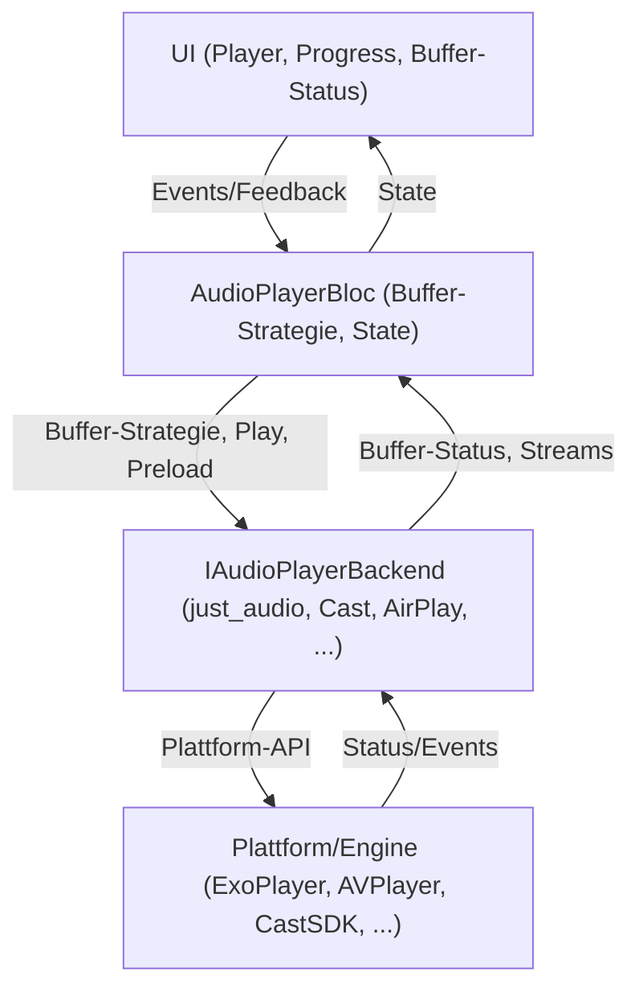

# Zukunftsfähiges Buffering- und Preload-Vorgehen für Flutter-Audioplayer (Stand: 09.06.2025)

## Zielsetzung

Eine modulare, plattformübergreifende und erweiterbare Architektur für Audio-Streaming und Buffering in Flutter, die folgende Anforderungen abdeckt:
- Android/iOS, ChromeCast, AirPlay, Web, Desktop
- just_audio und alternative Backends
- Adaptive Buffer-Strategien (vollständig, etappenweise, lazy-load)
- UI-Feedback für Buffer-Fortschritt
- Erweiterbarkeit für neue Technologien

---

## Architekturüberblick

---

## Komponenten & Erweiterbarkeit

- **IAudioPlayerBackend**: Kapselt alle Audio-Operationen (play, pause, preload, buffer, seek, etc.).
  - Implementierungen: just_audio, Cast, AirPlay, MediaKit, ...
- **AudioPlayerBloc**: Vermittelt zwischen UI und Backend, steuert Buffer-Strategie und State.
- **UI**: Zeigt Buffer-Fortschritt, Status, Fehler und Transport-Controls.
- **Provider/DI**: Dynamische Auswahl des Backends je nach Plattform/Feature.

---

## Buffering-Strategien

- **Vollständiges Preload**: Für kurze Tracks (z.B. <= 15 Minuten) wird der gesamte Track vorgeladen.
- **Etappenweises/Lazy-Load**: Für längere Tracks wird zunächst nur ein Teil gepuffert, weitere Abschnitte werden bei Bedarf nachgeladen.
- **Adaptive Strategie**: Die Buffer-Logik kann je nach Kategorie, Netzwerk, User-Setting oder Plattform angepasst werden.

---

## UI/UX-Feedback

- Buffer-Fortschritt wird im Player (z.B. unten links) als Progressbar oder Indikator angezeigt.
- Nutzer:innen sehen, wie viel bereits vorgeladen ist und wann ein nahtloser Start möglich ist.
- Fehler- und Retry-Status werden klar kommuniziert.

---

## Erweiterungspunkte & Empfehlungen

- Neue Backends (z.B. für Cast/AirPlay) können einfach ergänzt werden.
- Buffer-Strategie kann zentral im Bloc/Backend gesteuert und erweitert werden.
- UI bleibt unabhängig und konsumiert nur State/Streams.
- Dokumentation und Architekturdiagramme regelmäßig pflegen und mit den Best Practices abgleichen.

---

## Querverweise
- Siehe `.documents/audio_player_best_practices_2025.md` (Buffering, Preload, UI-Feedback)
- Siehe `.documents/audio_architektur_2025.md` (Architektur, Provider, Testbarkeit)
- Siehe README.md und Bloc-Kommentare für konkrete Implementierung

---

*Diese Strategie ist zukunftssicher, modular und für alle modernen Flutter-Audio-Anwendungen geeignet.*
