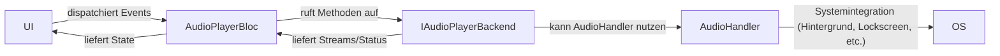

# Architekturübersicht: Modernes Audio-Streaming in Flutter

## 1. Komponenten & Schichten

**1.1 AudioHandler (Systemintegration)**
- Implementiert mit `audio_service` (z.B. `MyAudioHandler`).
- Kapselt die Audio-Engine (z.B. just_audio).
- Zuständig für:
  - Hintergrundwiedergabe
  - Sperrbildschirm/Benachrichtigungen (MediaSession, NowPlayingInfo)
  - Steuerung über Headset, Auto, Siri/Google Assistant
- Wird beim App-Start initialisiert und global bereitgestellt (Provider/DI).

**1.2 IAudioPlayerBackend (App-Logik)**
- Interface für die eigentliche Audio-Logik (Play, Pause, Seek, Playlist, etc.).
- Implementierungen: z.B. `JustAudioPlayerBackend`, `AudioPlayersBackend`.
- Wird im BLoC verwendet, ist unabhängig testbar und mockbar.

**1.3 AudioPlayerBloc (BLoC)**
- Vermittelt zwischen UI und Backend.
- Reagiert auf Events (Play, Pause, Seek, Next, etc.).
- Gibt States an die UI weiter.
- Hört auf Status-Streams des Backends (z.B. Position, Duration, Playing).

**1.4 Provider (Riverpod)**
- Stellt BLoC und Backend für UI und Tests bereit.
- Trennt Systemintegration (audioHandlerProvider) und App-Logik (audioPlayerBlocProvider).

**1.5 UI**
- Nutzt BLoC/Provider für State und Events.
- Kommuniziert nie direkt mit AudioHandler oder Backend.

---

## 2. Datenfluss



---

## 3. Testbarkeit

- **BLoC und Backend sind vollständig mockbar und unabhängig testbar.**
- Im Test wird ein Mock-Backend (`MockAudioPlayerBackend`) an den BLoC übergeben.
- Die Systemintegration (`audioHandlerProvider`) wird im Test überschrieben oder gemockt.

---

## 4. Beispiel-Provider

```dart
// lib/application/providers/audio_player_provider.dart
final audioPlayerBlocProvider = Provider<AudioPlayerBloc>((ref) {
  return AudioPlayerBloc(backend: AudioPlayersBackend());
});
```

```dart
// lib/application/providers/audio_handler_provider.dart
final audioHandlerProvider = Provider<AudioHandler>((ref) =>
    throw UnimplementedError('audioHandlerProvider muss im Test überschrieben werden'));
```

---

## 5. Best Practices

- **Trennung von Systemintegration und App-Logik**:  
  - `audioHandler` nur für OS-Integration, nicht für UI-Logik/BLoC.
  - `IAudioPlayerBackend` für alle UI-nahen Audio-Operationen.
- **Provider-Pattern**:  
  - Für jede Schicht einen eigenen Provider.
- **Testbarkeit**:  
  - Mock-Backends und Provider-Overrides in Tests.
- **Fehlerbehandlung**:  
  - Fehler im Backend/BLoC abfangen und als States an die UI geben.

---

## 6. Beispiel-Test (BLoC)

```dart
class MockAudioPlayerBackend extends Mock implements IAudioPlayerBackend {}

void main() {
  late MockAudioPlayerBackend backend;
  setUp(() {
    backend = MockAudioPlayerBackend();
    // Streams und Methoden stubben
  });

  test('PlayEpisode führt zu Loading und dann Playing', () async {
    final bloc = AudioPlayerBloc(backend: backend);
    // Testlogik...
  });
}
```

---

## 7. Übersichtstabelle: IST vs. SOLL der Audio-Architektur (Juni 2025)

| Aspekt                | IST (Alt)                                              | SOLL (Neu, Ziel)                                         |
|-----------------------|--------------------------------------------------------|----------------------------------------------------------|
| **Systemintegration** | AudioHandler teils direkt in UI/BLoC verwendet         | AudioHandler nur für OS/Background, nie direkt in UI/BLoC |
| **App-Logik**         | Audio-Logik teils im Handler, teils in Widgets         | Saubere Trennung: IAudioPlayerBackend für App-Logik       |
| **BLoC**              | BLoC nimmt teils AudioHandler, teils Backend           | BLoC nimmt immer IAudioPlayerBackend als Abhängigkeit     |
| **Provider**          | Vermischte Provider, teils Handler, teils Backend      | Klare Provider-Trennung: audioHandlerProvider & audioPlayerBlocProvider |
| **Testbarkeit**       | Tests schwer, da Handler nicht gut mockbar             | Volle Testbarkeit: MockBackend für BLoC, Handler nur stub |
| **Fehlerbehandlung**  | Fehlerhandling teils im Widget, teils im Handler       | Fehlerhandling zentral im BLoC/Backend, State-basiert     |
| **State-Management**  | Teilweise direkte Streams/Flags in Widgets             | State nur über BLoC/Provider, UI ist rein konsumierend    |
| **Architektur-Doku**  | Verstreute Hinweise, keine zentrale Übersicht          | Zentrale, aktuelle Architekturübersicht vorhanden         |
| **Best Practices**    | Nicht immer konsistent umgesetzt                      | Best Practices (Trennung, Testbarkeit, Provider) überall  |

> **Hinweis:** Für Details und Umsetzung siehe die Abschnitte oben und die Quellverweise.

---

## 8. Architektur-Entscheidung & Ziel (Stand Juni 2025)

**Wichtige Erkenntnis aus PRD und Projektzielen:**

- Die App-Logik (Play, Pause, Seek, Fehlerhandling etc.) wird vorrangig über das Backend (`IAudioPlayerBackend`, z.B. `JustAudioPlayerBackend`) und den `AudioPlayerBloc` abgebildet.
- Der `audioHandler` (audio_service) ist für die Systemintegration (z.B. Hintergrundwiedergabe, Lockscreen, Headset, AirPlay/Chromecast) zuständig und wird später angebunden.
- Die Architektur muss so gestaltet sein, dass das Backend später an den `audioHandler` angebunden werden kann, um systemweite Player-Features (z.B. AirPlay/Chromecast) zu ermöglichen.
- Die UI und der BLoC kommunizieren ausschließlich mit dem Backend, nie direkt mit dem `audioHandler`.
- Diese Trennung garantiert Testbarkeit, Erweiterbarkeit und eine saubere Clean Architecture.

**Ziel:**
- Zuerst: Fokus auf ein robustes, testbares Backend und BLoC für die Audio-Logik.
- Später: Anbindung des Backends an den `audioHandler` für Systemintegration und Features wie AirPlay/Chromecast.

---

**Quellen:**  
- [just_audio](https://pub.dev/packages/just_audio)
- [audio_service](https://pub.dev/packages/audio_service)
- [audio_session](https://pub.dev/packages/audio_session)
- [flutter_bloc](https://pub.dev/packages/flutter_bloc)

---

**Hinweis:**  
Diese Architektur ist optimal für moderne Flutter-Projekte mit Fokus auf Testbarkeit, Wartbarkeit und Systemintegration.
